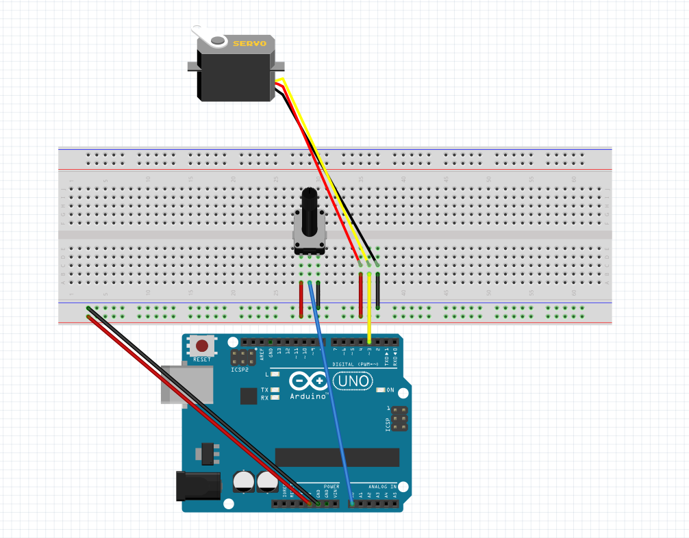

### Guide de démarrage

Connecter son arduino sur un port de votre PC.
Pour le montage vous pouvez télécharger Fritzing pour ouvrir le fichier ./Readme/Schema.fzz à la racine. Sinon suivez le schéma suivant: 

Il est possible d'obtenir la liste des ports USB utilisés par la machine avec le package @serialport/list

        npm install -g @serialport/list
        serialport-list

Une fois le port trouvé,  vous pouvez modifier la ligne 34 du fichier server.js à la racine du projet pour adapter le code 
au port utiliser par votre machine.

Préparer le serveur et le client à être démarré:

        npm run server-install
        npm run client-install
        npm run server+client

## License & copyright

Mathieu Ibersien, Florent Lore

Licensed under the  [MIT License](LICENSE).