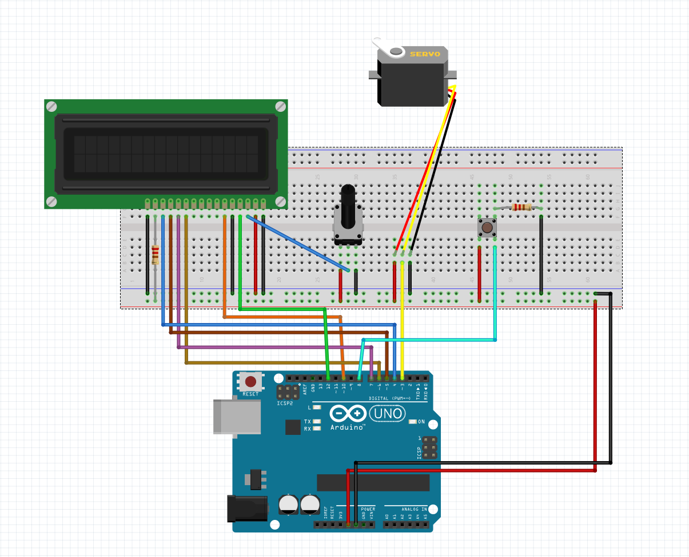

# Lego Controller

Ce projet a été réalisé dans le cadre de la matière IOT en M2 IWOCS à l'université du Havre. Il s'agit d'un projet Fullstack réunissant un Front React relié à un serveur Node.js communicant avec un Arduino Uno. Dans le cadre de notre projet, une porte coulissante réalisée en Lego Star Wars s'ouvre soit grâce à l'interface, soit par un bouton physique présent sur le montage de l'Arduino.

### Guide de démarrage

Connecter son arduino sur un port de votre PC.
Pour le montage Arduino vous pouvez télécharger Fritzing pour ouvrir le fichier *./Readme/Schema_final.fzz* à la racine. Sinon suivez le schéma suivant: 

Il est possible d'obtenir la liste des ports USB utilisés par la machine avec le package @serialport/list

        npm install -g @serialport/list
        serialport-list

Une fois le port trouvé,  vous pouvez modifier la ligne 34 du fichier server.js à la racine du projet pour adapter le code 
au port utiliser par votre machine pour connecter votre Arduino.

Assurez vous que votre port à le droit de lecture et écriture: 

        sudo chmod a+rxw /dev/ttyACM0

Importez le code Arduino sur votre appareil se trouvant dans ./Arduino_Lego_Door_Flo

Préparer le serveur et le client à être démarré:

        npm run server-install
        npm run client-install
        npm run server
        npm run client

## License & copyright

Mathieu Ibersien, Florent Lore

Licensed under the  [MIT License](LICENSE).
